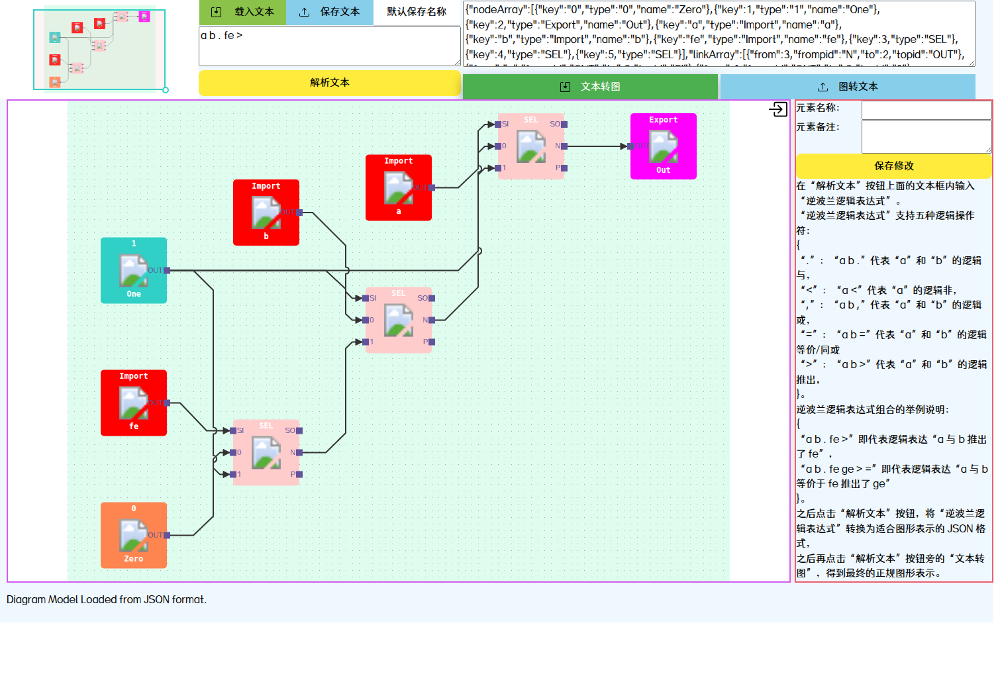
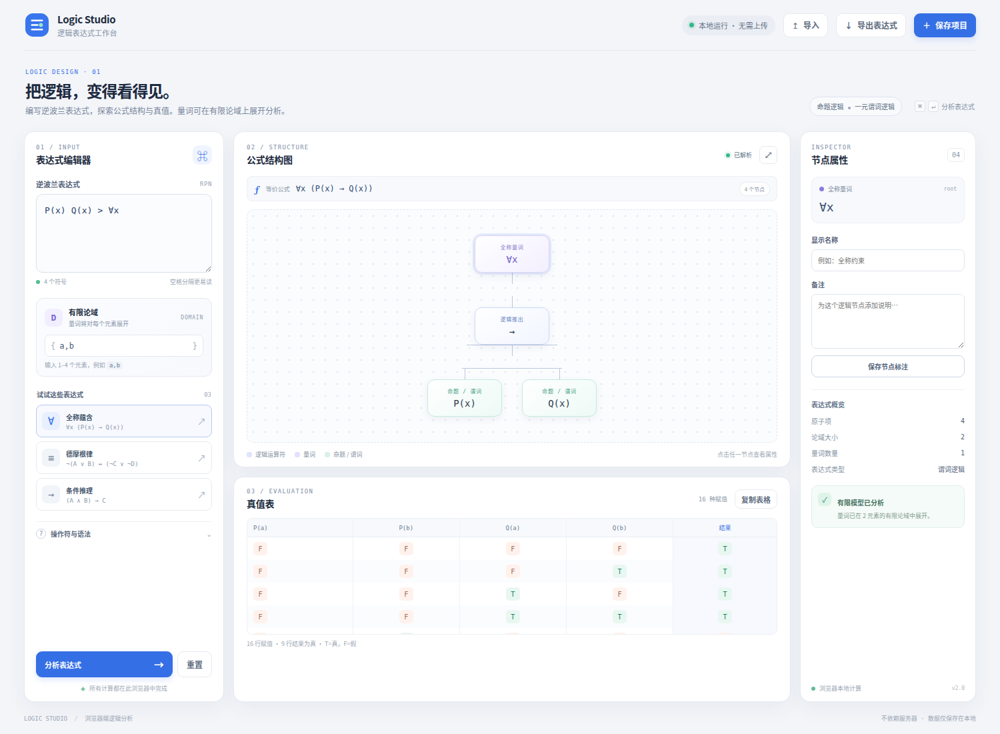

# Logic Studio · 逻辑表达式工作台

这是对 [2021 年旧版逻辑模拟器](https://kuangdash.gitlab.io/logicsim/) 的静态重构。原站以逆波兰逻辑表达式为输入，先转换为模型 JSON，再生成可编辑的逻辑图；支持逻辑与、非、或、等价、推出，以及节点名称和备注编辑。本项目保留这些操作符和核心表达式工作流，并把旧版的多步 JSON 中转改成公式树与真值表的直接联动。

## 本地运行

项目只有静态 HTML、CSS、JavaScript 文件，无构建步骤、服务端代码或第三方运行时依赖。可直接打开 `index.html`，或在此目录运行：

```bash
python3 -m http.server 8080
```

然后访问 `http://localhost:8080`。

## 表达式语法

表达式采用空格分隔的后缀（逆波兰）记法，继续兼容旧站操作符：

| 记号 | 意义 | 元数 |
| --- | --- | --- |
| `.` | 与（∧） | 2 |
| `,` | 或（∨） | 2 |
| `<` | 非（¬） | 1 |
| `>` | 推出（→） | 2 |
| `=` | 等价（↔） | 2 |
| `∀x` | 对左侧子式中的自由变量 `x` 作全称量化 | 1 |
| `∃x` | 对左侧子式中的自由变量 `x` 作存在量化 | 1 |

量词后置，限定它左侧最近构成的完整子式。例如：

```text
P(x) Q(x) > ∀x
```

表示 `∀x (P(x) → Q(x))`。谓词原子使用一元形式 `P(x)`；论域在界面中输入，默认是 `{a,b}`。量词在此有限论域上按一阶逻辑语义展开：`∀` 对域内实例取合取，`∃` 取析取。各个谓词实例（如 `P(a)`、`P(b)`）作为独立原子命题出现在真值表中。命题变量如 `A`、`B` 也可混合使用。论域支持 1–4 个元素，真值表最多展开 8 个原子项（256 行）。

操作符示例：

```text
A B . C >       # (A ∧ B) → C
A B , <         # ¬(A ∨ B)
A B =           # A ↔ B
```

## 改造内容

- **界面重做：** 从拥挤的三栏旧式页面，改为响应式工作台，提供表达式编辑器、公式结构图、节点属性和结果面板。
- **公式树直观呈现：** 原站需要单独生成 JSON 再点“文本转图”；新版解析后直接显示可点击的公式树，并能为节点保存显示名称和备注。
- **新增量词与有限论域：** 支持 `∀x`、`∃x` 与一元谓词 `P(x)`，按用户给定论域展开，并在真值表中计算。
- **分析结果联动：** 显示完整命题/谓词真值表、公式结构、原子项数量与论域信息；错误提示指出操作数不足或表达式未组合完整。
- **文件与隐私：** 导入/导出文本表达式和项目 JSON，复制/下载 TSV 真值表，浏览器本地记住最近的表达式与论域。输入内容不会发送到服务器。
- **静态部署：** 无构建步骤，所有交互在浏览器本地运行；布局适配手机和桌面。

## 界面对照

改造前保留旧站的逆波兰输入、JSON 中转、图形生成与属性栏；改造后直接在表达式树和真值表中查看结果。

### 改造前：旧版逻辑模拟器



### 改造后：Logic Studio 工作台



## 部署

这是纯静态站点，可部署到 Vercel、GitHub Pages、GitLab Pages 或 Cloudflare Pages；不需要 Build Command，输出目录为仓库根目录。
